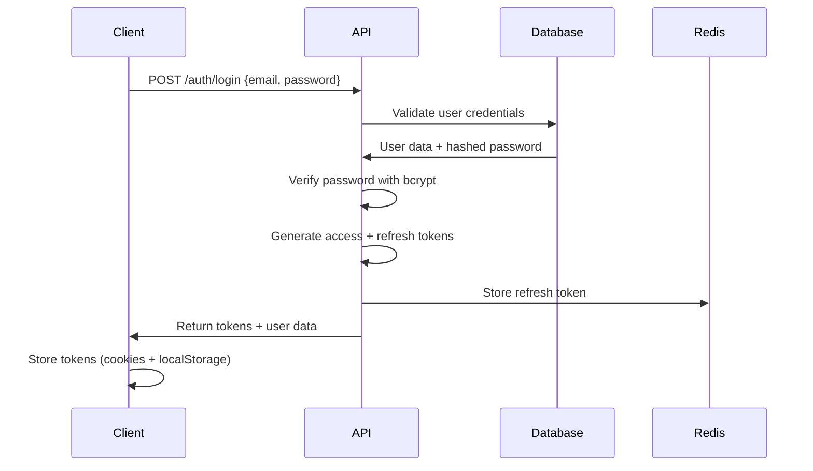
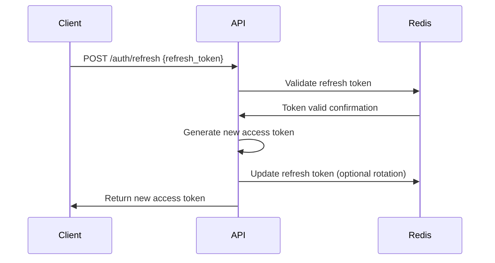
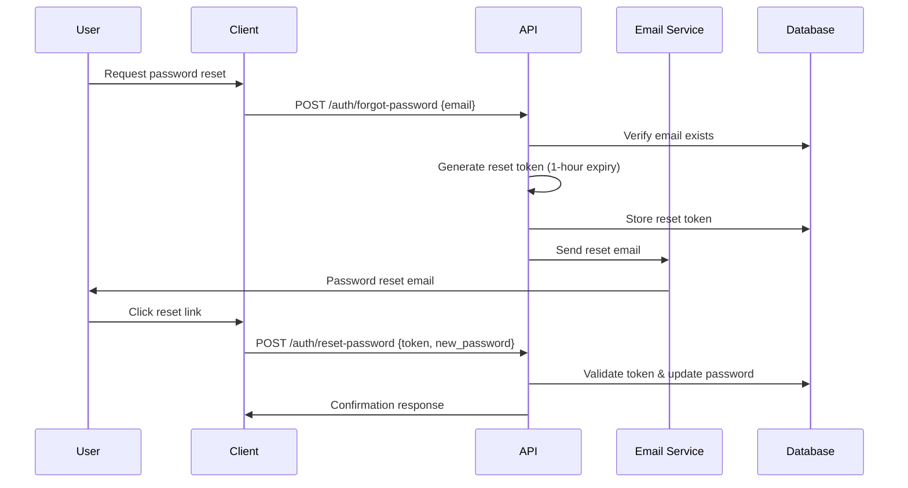

# Authentication & Authorization Architecture

## Overview
ACE CRM implements a comprehensive authentication and authorization system using JWT tokens, role-based access control (RBAC), and industry security best practices.

## Authentication Flow

### JWT Token Strategy
- **Access Token**: Short-lived (24 hours) for API requests
- **Refresh Token**: Long-lived (30 days) for token renewal
- **Token Storage**: HttpOnly cookies + localStorage for hybrid approach
- **Token Format**: JWT with RS256 signing algorithm

### Login Process


### Token Refresh Process


### Password Reset Flow


## Authorization System

### Role-Based Access Control (RBAC)

#### Default Roles
1. **Super Admin**
   - Full system access
   - User management
   - System configuration
   - All data access

2. **Admin**
   - Organization management
   - User management (within organization)
   - All CRM data access
   - Billing and invoicing

3. **Manager**
   - Team management
   - All CRM data access
   - Project management
   - Report generation

4. **Sales Rep**
   - Lead and deal management
   - Contact management
   - Activity logging
   - Personal pipeline access

5. **Project Manager**
   - Project management
   - Task management
   - Team coordination
   - Client communication

6. **Developer**
   - Task management
   - Time tracking
   - Project access
   - Limited contact access

7. **Client** (External)
   - Project view access
   - Invoice access
   - Communication with team
   - Limited system access

### Permission System

#### Permission Categories
```json
{
  "users": {
    "read": "View user profiles",
    "create": "Create new users",
    "update": "Edit user information",
    "delete": "Remove users",
    "manage_roles": "Assign/remove roles"
  },
  "contacts": {
    "read": "View contacts",
    "create": "Add new contacts",
    "update": "Edit contact information",
    "delete": "Remove contacts",
    "export": "Export contact data",
    "import": "Import contact data"
  },
  "companies": {
    "read": "View companies",
    "create": "Add new companies",
    "update": "Edit company information",
    "delete": "Remove companies"
  },
  "leads": {
    "read": "View leads",
    "create": "Create new leads",
    "update": "Edit lead information",
    "delete": "Remove leads",
    "convert": "Convert leads to deals",
    "assign": "Assign leads to users"
  },
  "deals": {
    "read": "View deals",
    "create": "Create new deals",
    "update": "Edit deal information",
    "delete": "Remove deals",
    "close": "Close deals (won/lost)",
    "assign": "Assign deals to users"
  },
  "projects": {
    "read": "View projects",
    "create": "Create new projects",
    "update": "Edit project information",
    "delete": "Remove projects",
    "manage_team": "Add/remove team members"
  },
  "tasks": {
    "read": "View tasks",
    "create": "Create new tasks",
    "update": "Edit task information",
    "delete": "Remove tasks",
    "assign": "Assign tasks to users"
  },
  "invoices": {
    "read": "View invoices",
    "create": "Create new invoices",
    "update": "Edit invoice information",
    "delete": "Remove invoices",
    "send": "Send invoices to clients",
    "payment": "Record payments"
  },
  "reports": {
    "view_own": "View personal reports",
    "view_team": "View team reports",
    "view_all": "View organization reports",
    "export": "Export report data"
  },
  "settings": {
    "read": "View system settings",
    "update": "Modify system settings",
    "custom_fields": "Manage custom fields"
  }
}
```

#### Role Permission Matrix
```json
{
  "super_admin": ["*"], // All permissions
  "admin": [
    "users.*", "contacts.*", "companies.*", 
    "leads.*", "deals.*", "projects.*", 
    "tasks.*", "invoices.*", "reports.*", 
    "settings.*"
  ],
  "manager": [
    "users.read", "contacts.*", "companies.*",
    "leads.*", "deals.*", "projects.*",
    "tasks.*", "invoices.*", "reports.view_team"
  ],
  "sales_rep": [
    "contacts.*", "companies.read", "companies.update",
    "leads.*", "deals.*", "activities.*",
    "reports.view_own"
  ],
  "project_manager": [
    "contacts.read", "companies.read",
    "projects.*", "tasks.*", "activities.*",
    "reports.view_own"
  ],
  "developer": [
    "tasks.read", "tasks.update", "projects.read",
    "activities.create", "activities.read"
  ],
  "client": [
    "projects.read", "invoices.read", "activities.read"
  ]
}
```

## Middleware & Security

### Authentication Middleware
```typescript
interface AuthMiddleware {
  // Verify JWT token
  verifyToken(token: string): Promise<DecodedToken>;
  
  // Check if token is blacklisted
  isTokenBlacklisted(tokenId: string): Promise<boolean>;
  
  // Extract user from token
  extractUser(token: string): Promise<User>;
  
  // Handle token expiration
  handleExpiredToken(): Response;
}
```

### Authorization Middleware
```typescript
interface AuthorizationMiddleware {
  // Check if user has specific permission
  hasPermission(user: User, permission: string): boolean;
  
  // Check multiple permissions (AND logic)
  hasAllPermissions(user: User, permissions: string[]): boolean;
  
  // Check multiple permissions (OR logic)
  hasAnyPermission(user: User, permissions: string[]): boolean;
  
  // Resource-based authorization
  canAccessResource(user: User, resource: Resource): boolean;
  
  // Dynamic permission checking
  checkResourceOwnership(user: User, resourceId: string, resourceType: string): Promise<boolean>;
}
```

### Security Headers
```typescript
const securityHeaders = {
  'Strict-Transport-Security': 'max-age=31536000; includeSubDomains',
  'X-Content-Type-Options': 'nosniff',
  'X-Frame-Options': 'DENY',
  'X-XSS-Protection': '1; mode=block',
  'Content-Security-Policy': "default-src 'self'; script-src 'self' 'unsafe-inline'",
  'Referrer-Policy': 'strict-origin-when-cross-origin'
};
```

## Data Access Control

### Row-Level Security (RLS)
PostgreSQL RLS policies for data isolation:

```sql
-- Enable RLS on all tables
ALTER TABLE contacts ENABLE ROW LEVEL SECURITY;
ALTER TABLE companies ENABLE ROW LEVEL SECURITY;
ALTER TABLE leads ENABLE ROW LEVEL SECURITY;
ALTER TABLE deals ENABLE ROW LEVEL SECURITY;
ALTER TABLE projects ENABLE ROW LEVEL SECURITY;

-- Example: Users can only see contacts they own or have permission to view
CREATE POLICY contact_access_policy ON contacts
  USING (
    owner_id = current_setting('app.current_user_id')::UUID
    OR 
    current_setting('app.user_role') = 'admin'
    OR
    current_setting('app.user_role') = 'super_admin'
  );
```

### Data Filtering by Organization
Multi-tenant data isolation:

```typescript
interface DataFilter {
  // Filter data by organization
  byOrganization(organizationId: string): QueryBuilder;
  
  // Filter by ownership
  byOwner(userId: string): QueryBuilder;
  
  // Filter by team membership
  byTeamAccess(userId: string): QueryBuilder;
  
  // Apply user context
  withUserContext(user: User): QueryBuilder;
}
```

## Session Management

### Session Storage
- **Backend**: Redis for session data
- **Frontend**: HttpOnly cookies + localStorage hybrid
- **Session Duration**: 24 hours with sliding expiration
- **Concurrent Sessions**: Limited to 5 per user

### Session Data
```typescript
interface SessionData {
  userId: string;
  organizationId: string;
  roles: string[];
  permissions: string[];
  lastActivity: Date;
  ipAddress: string;
  userAgent: string;
  deviceFingerprint?: string;
}
```

### Session Invalidation
- Logout action
- Password change
- Role modification
- Suspicious activity detection
- Admin force logout

## API Security

### Rate Limiting
```typescript
const rateLimits = {
  // General API
  '/api/': { windowMs: 15 * 60 * 1000, max: 100 }, // 100 requests per 15 minutes
  
  // Authentication endpoints
  '/auth/login': { windowMs: 15 * 60 * 1000, max: 5 }, // 5 login attempts per 15 minutes
  '/auth/register': { windowMs: 60 * 60 * 1000, max: 3 }, // 3 registrations per hour
  '/auth/forgot-password': { windowMs: 60 * 60 * 1000, max: 3 }, // 3 password resets per hour
  
  // Resource creation
  '/api/*/create': { windowMs: 60 * 1000, max: 10 }, // 10 creates per minute
  
  // File uploads
  '/files/upload': { windowMs: 60 * 1000, max: 5 } // 5 uploads per minute
};
```

### Input Validation & Sanitization
```typescript
interface ValidationRules {
  // Email validation
  email: /^[^\s@]+@[^\s@]+\.[^\s@]+$/;
  
  // Strong password requirements
  password: {
    minLength: 8,
    requireUppercase: true,
    requireLowercase: true,
    requireNumbers: true,
    requireSpecialChars: true,
    blacklistedPasswords: ['password123', 'admin123']
  };
  
  // Phone number validation
  phone: /^\+?[\d\s\-\(\)]{10,15}$/;
  
  // Sanitize HTML input
  sanitizeHtml: true;
  
  // SQL injection prevention
  parameterizedQueries: true;
}
```

## Audit Logging

### Security Events
```typescript
interface SecurityAuditLog {
  eventType: 'login' | 'logout' | 'permission_denied' | 'password_change' | 'role_change';
  userId: string;
  ipAddress: string;
  userAgent: string;
  success: boolean;
  details: Record<string, any>;
  timestamp: Date;
  severity: 'low' | 'medium' | 'high' | 'critical';
}
```

### Monitoring & Alerts
- Failed login attempts (>5 in 15 minutes)
- Permission escalation attempts
- Unusual access patterns
- Mass data exports
- After-hours access
- Multiple concurrent sessions

## Implementation Guidelines

### Backend Implementation
1. Use `jsonwebtoken` library for JWT handling
2. Implement `bcrypt` for password hashing (cost factor: 12)
3. Use `express-rate-limit` for rate limiting
4. Implement `helmet` for security headers
5. Use `validator` library for input validation

### Frontend Implementation
1. Store tokens securely (HttpOnly cookies preferred)
2. Implement automatic token refresh
3. Handle token expiration gracefully
4. Implement proper logout cleanup
5. Use HTTPS for all requests

### Database Security
1. Use prepared statements/parameterized queries
2. Enable row-level security (RLS)
3. Regular security updates
4. Database connection encryption
5. Backup encryption

This authentication and authorization architecture provides enterprise-level security while maintaining usability and scalability for the ACE CRM system.